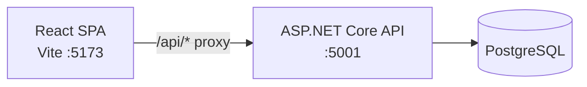
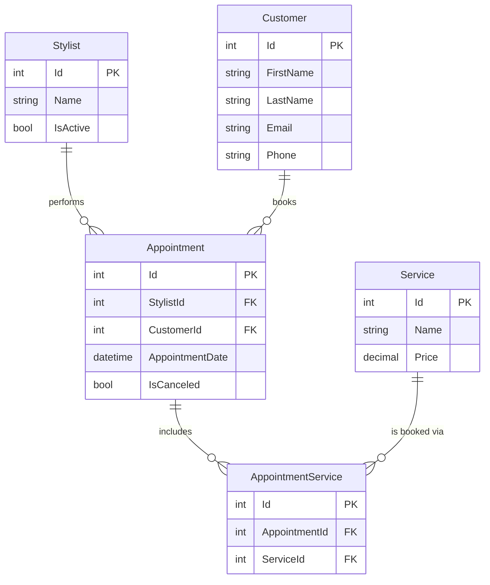

<!-- Last updated: 2026-06-11 -->
<!-- Last change: Initial architecture document -->

# Hillary's Haircare - Technical Architecture

## System Overview

A full-stack hair salon management tool. The React SPA handles all UI; the ASP.NET Core API owns all data access; PostgreSQL is the single store of record. The Vite dev server proxies `/api` requests to the .NET backend, so the browser never makes a cross-origin request and no CORS middleware is needed.



## Codebase Map

```
HillarysHaircare/                      # ASP.NET Core Web API project root
  Program.cs                           # App entry point: DI registration and all endpoint mapping
  HillarysHaircareDbContext.cs         # EF Core DbContext; DbSets for each entity
  HillarysHaircare.csproj              # Project file; Npgsql.EF and OpenAPI packages
  appsettings.Development.json         # Dev config; connection string key: HillarysHaircareDbConnectionString
  Models/
    Stylist.cs                         # Entity: Id, Name, IsActive
    Customer.cs                        # Entity: Id, FirstName, LastName, Email, Phone
    Service.cs                         # Entity: Id, Name, Price
    Appointment.cs                     # Entity: Id, StylistId, CustomerId, AppointmentDate, IsCanceled
    AppointmentService.cs              # Join table entity: Id, AppointmentId, ServiceId
  Migrations/                          # EF Core migration history
  Properties/
    launchSettings.json                # http :5000, https :5001

client/                                # React SPA (Vite)
  src/
    App.jsx                            # Root component and router outlet (boilerplate, not started)
    main.jsx                           # React entry point
  vite.config.js                       # Proxies /api/* to https://localhost:5001
  package.json                         # React 19, react-router-dom v7
```

## Entry Points

**API:** `Program.cs` is the single entry point. It registers services (EF Core, Npgsql), builds the app, and maps all endpoints inline. There are no controllers.

**React:** `client/src/main.jsx` mounts the `<App />` component. `App.jsx` will own the router and top-level layout.

**Dev workflow:** Run `dotnet run` from the project root (starts API on :5001), then `npm run dev` from `client/` (starts Vite on :5173). Open the browser at `http://localhost:5173`. All `/api` fetch calls from React are silently forwarded to the .NET backend by Vite.

## Component Breakdown

| Component | Responsibility | Communicates With |
|-----------|---------------|-------------------|
| React SPA | UI: views, forms, navigation | ASP.NET Core API via `fetch("/api/...")` |
| ASP.NET Core API | HTTP request handling, business logic, data access | PostgreSQL via EF Core DbContext |
| EF Core DbContext | Maps C# model classes to DB tables; executes queries | PostgreSQL |
| PostgreSQL | Persistent data storage | EF Core only |

The API and React app are in the same repository. The API has no concept of the frontend; the frontend has no direct database access.

## Data Model

Five entities. `AppointmentService` is the explicit join table for the many-to-many between `Appointment` and `Service`.

**Current gap:** `AppointmentService` exists as a model class but is not yet registered as a `DbSet` in `HillarysHaircareDbContext`, and has no corresponding table in the database. This must be fixed (add DbSet + new migration) before the appointment endpoints can be built.



Navigation properties (not yet on the model classes) are required for EF Core `Include()` to work. Each model needs a property pointing to its related entities. For example, `Appointment` needs `Stylist`, `Customer`, and `List<AppointmentService>` properties.

## API Design

All endpoints are mapped in `Program.cs` using the Minimal API pattern (`app.MapGet`, `app.MapPost`, etc.). No controller classes.

| Method | Route | Description | Success Code |
|--------|-------|-------------|--------------|
| GET | /api/stylists | All stylists | 200 |
| POST | /api/stylists | Create a stylist | 201 |
| PUT | /api/stylists/{id} | Update stylist (includes deactivate) | 204 |
| GET | /api/customers | All customers | 200 |
| POST | /api/customers | Create a customer | 201 |
| GET | /api/services | All services | 200 |
| POST | /api/services | Create a service | 201 |
| PUT | /api/services/{id} | Edit a service | 204 |
| GET | /api/appointments | All appointments with stylist, customer, services | 200 |
| GET | /api/appointments/{id} | Single appointment with total cost calculated | 200 |
| POST | /api/appointments | Create appointment + AppointmentService records | 201 |
| PUT | /api/appointments/{id} | Cancel appointment (IsCanceled = true) | 204 |

Endpoints that look up a record by `{id}` should return `404 Not Found` if the record does not exist.

The total cost for an appointment is not stored in the database. It is calculated at query time by summing the `Price` of each `Service` linked through `AppointmentService`.

## Migration Path

The scaffold is in place. Development follows this sequence:

1. **Fix the DbContext gap**: Add `DbSet<AppointmentService> AppointmentServices` to `HillarysHaircareDbContext`, then run a new migration to create the `AppointmentServices` table.
2. **Add navigation properties**: Update each model class to include properties for related entities. This is required before `Include()` will work.
3. **Build API endpoints**: Work one GitHub issue at a time. Simpler, independent entities (Stylists, Customers, Services) first; Appointments last because they depend on the others and the join table.
4. **Build React views**: Wire up each view to its API endpoint as endpoints become available.

## Infrastructure and Deployment

Local development only (NSS project). No CI/CD or cloud hosting in scope.

- .NET API: `dotnet run` from the project root
- React: `npm run dev` from `client/`
- Database: PostgreSQL running locally; connection string stored in `appsettings.Development.json` under key `HillarysHaircareDbConnectionString`

## Key Technical Decisions

| Decision | Choice | Reason |
|----------|--------|--------|
| API pattern | Minimal API (Program.cs) | NSS Book 2 curriculum pattern; no controllers |
| CORS | Not needed | Vite proxy forwards `/api` calls; browser sees same origin |
| Many-to-many | Explicit join entity (`AppointmentService`) | Required for Book 2 many-to-many chapter (DeShawn's pattern) |
| Deletes | Soft delete only | `IsCanceled` on Appointment, `IsActive` on Stylist; no hard deletes |
| Total cost | Calculated at query time | Derived from service prices; storing it would risk stale data |

## Project Conventions

### Commits and Branches

- One feature branch per GitHub issue: `feature/[issue-number]/[short-description]`
- PR descriptions reference the issue: `closes #N`
- Merge to `main` when the feature is working end-to-end

### Code Style

- Model classes live in `Models/`
- All endpoint handlers stay in `Program.cs` (no separate files for routes)
- Use `Include()` and `ThenInclude()` for related data; do not make multiple round trips for data that can be fetched in one query
- Return `Results.NotFound()` for missing records, `Results.Created()` for new records, `Results.NoContent()` for updates

### Unanswered Questions

- Issue #1 was not visible in the GitHub issues list (issues #2-13 were shown). Confirm whether #1 exists and what feature it covers.
- `AppointmentService` migration is missing. Confirm there are no existing `AppointmentServices` records in the database before running a new migration.
